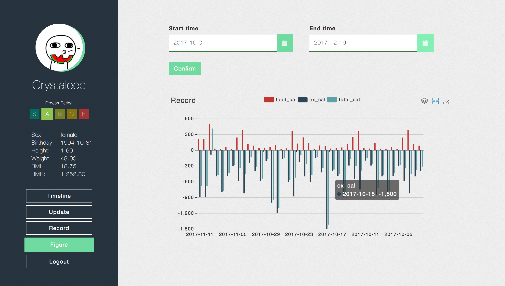

# Carry

CSC410 Web Programming project of team SometimesNaive

Carry is a personal fitness web application which can record users' daily diet and exercise, analyze users' fitness status and graph their health. It is built with Spring MVC and AngularJS, using Maven and Gulp as development tools.

## Features
* Create account
* Edit Profile
* Record Daily diet and exercise
* Calculate BMI & BMR
* Generate diet and exercise graph on seleted period of time 

## Getting Started
### Prerequisites
* Apache Tomcat
* Maven
* Gulp

### Quick Start
* For Backend: Maven build
* For Frontend:
```
gulp start
```

## Screenshots and demo GIF




